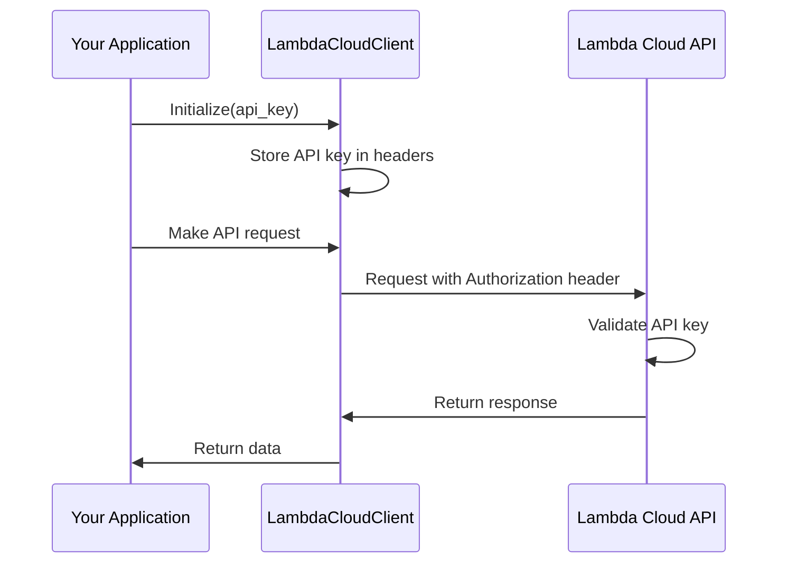

# Authentication

This document details how authentication works with the Lambda Cloud Python client.

## Overview

The Lambda Cloud API uses API keys for authentication. These keys are used to identify and authorize your requests.

## Obtaining an API Key

To obtain an API key for Lambda Cloud:

1. Log in to your Lambda Cloud account
2. Navigate to the API Keys page (https://cloud.lambdalabs.com/api-keys)
3. Generate a new API key
4. Copy and securely store the key immediately - it will only be shown once

## Client Authentication

The Lambda Cloud Python client accepts your API key during initialization and handles authentication for all subsequent API calls.

```python
from lambda_cloud_python import LambdaCloudClient

# Initialize with your API key
client = LambdaCloudClient(api_key="your-api-key")

# Now all operations will be authenticated automatically
```

## Authentication Methods

The client uses Bearer token authentication by default, which includes your API key in the Authorization header for each request:

```
Authorization: Bearer <API-KEY>
```

The underlying HTTP client is configured during initialization, so you don't need to manually handle authentication details.

## Security Best Practices

1. **Store API keys securely**: Don't hardcode them in your scripts or commit them to version control
2. **Use environment variables**: Store your API key in an environment variable and access it in your code
3. **Set appropriate permissions**: If possible, use API keys with the minimum required permissions
4. **Rotate keys regularly**: Generate new API keys periodically and revoke old ones
5. **Use separate keys**: For different applications or environments, use different API keys

## Example: Using Environment Variables

```python
import os
from lambda_cloud_python import LambdaCloudClient

# Get API key from environment variable
api_key = os.environ.get("LAMBDA_API_KEY")

if not api_key:
    raise ValueError("LAMBDA_API_KEY environment variable is not set")

# Initialize client with the API key
client = LambdaCloudClient(api_key=api_key)

# Now you can use the client
```

## Authentication Flow


