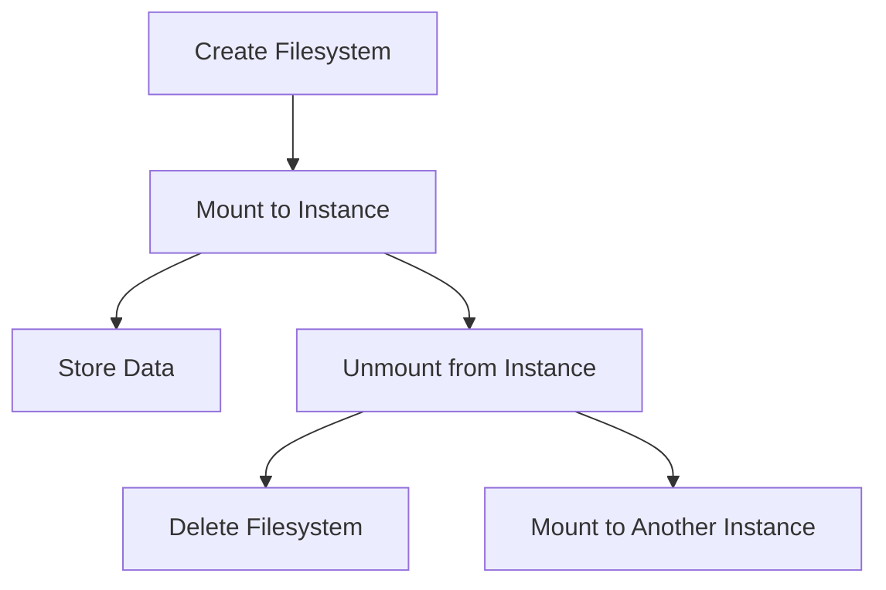

# Filesystems

This document details the operations available for managing filesystems in Lambda Cloud through the Python client.

## Endpoint Overview

The Filesystems module provides methods for managing persistent storage:

- List all filesystems in your account
- Create a new filesystem
- Delete an existing filesystem

## Filesystem Lifecycle



## Usage Examples

### Listing Filesystems

```python
from lambda_cloud_python import LambdaCloudClient, Filesystems

client = LambdaCloudClient(api_key="your-api-key")
filesystems = Filesystems(client)

# Get all filesystems
fs_list = filesystems.list()

# Display filesystem details
for fs in fs_list:
    status = "In use" if fs["is_in_use"] else "Not in use"
    region = fs["region"]["name"]

    print(f"Filesystem: {fs['name']} (ID: {fs['id']})")
    print(f"  Status: {status}")
    print(f"  Region: {region}")
    print(f"  Mount point: {fs['mount_point']}")

    # If bytes_used is available, show storage usage
    if "bytes_used" in fs:
        gb_used = fs["bytes_used"] / (1024 * 1024 * 1024)
        print(f"  Storage used: {gb_used:.2f} GB")

    print(f"  Created: {fs['created']}")
    print(f"  Created by: {fs['created_by']['email']}")
    print("")
```

### Creating a Filesystem

```python
from lambda_cloud_python import LambdaCloudClient, Filesystems

client = LambdaCloudClient(api_key="your-api-key")
filesystems = Filesystems(client)

# Create a new filesystem in a specific region
name = "ml-datasets"  # Must start with a letter and contain only alphanumeric chars and hyphens
region = "us-west-1"  # Specify the region code

new_fs = filesystems.create(name, region)

print(f"Created filesystem: {new_fs['name']} (ID: {new_fs['id']})")
print(f"Mount point: {new_fs['mount_point']}")
print(f"Region: {new_fs['region']['name']}")
```

### Deleting a Filesystem

```python
from lambda_cloud_python import LambdaCloudClient, Filesystems

client = LambdaCloudClient(api_key="your-api-key")
filesystems = Filesystems(client)

# Delete a filesystem by ID
# Note: The filesystem must not be attached to any instances
filesystem_id = "398578a2336b49079e74043f0bd2cfe8"

try:
    result = filesystems.delete(filesystem_id)
    print(f"Deleted filesystem IDs: {result['deleted_ids']}")
except Exception as e:
    print(f"Error deleting filesystem: {e}")
    print("If the filesystem is in use, detach it from all instances first.")
```

### Complete Workflow: Create and Use Filesystem

```python
from lambda_cloud_python import LambdaCloudClient, Filesystems, Instances
import time

client = LambdaCloudClient(api_key="your-api-key")
filesystems = Filesystems(client)
instances = Instances(client)

# Step 1: Create filesystem
fs_name = "project-data"
region = "us-west-1"
new_fs = filesystems.create(fs_name, region)
fs_id = new_fs["id"]

print(f"Created filesystem: {new_fs['name']} (ID: {fs_id})")
print(f"Mount point: {new_fs['mount_point']}")

# Step 2: Launch instance with the filesystem attached
result = instances.launch(
    region_name=region,  # Must be the same region as the filesystem
    instance_type_name="gpu_1x_a10",
    ssh_key_names=["my-ssh-key"],
    name="ML Instance with Data",
    file_system_names=[fs_name],
)

instance_id = result["instance_ids"][0]
print(f"Launched instance: {instance_id}")

# Wait for instance to be active
time.sleep(60)  # Simple wait - in production, implement polling

# Step 3: Verify instance details with attached filesystem
instance = instances.get(instance_id)

print(f"Instance {instance['name']} is {instance['status']}")
print(f"Attached filesystems: {instance['file_system_names']}")
print(f"To connect: ssh ubuntu@{instance['ip']}")
print(f"Filesystem is available at: {new_fs['mount_point']}")
```
