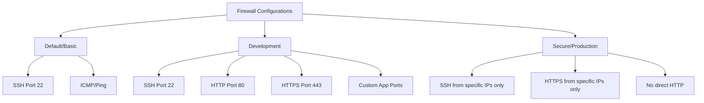

# Firewall Rules

This document details the operations available for managing firewall rules in Lambda Cloud through the Python client.

## Endpoint Overview

The FirewallRules module provides methods for controlling inbound traffic to your instances:

- List current inbound firewall rules
- Replace all inbound firewall rules with a new set

**Note:** Firewall rules do not apply to the **us-south-1** region.

## Firewall Rule Concepts

Firewall rules in Lambda Cloud control inbound traffic to your instances. Each rule specifies:

- Protocol (tcp, udp, icmp, or all)
- Port range (for tcp, udp, and all protocols)
- Source network in CIDR notation (e.g., 0.0.0.0/0 for any IP)
- Description

When you replace the rules, you replace the entire set at once. There is no way to add or remove individual rules.

## Usage Examples

### Listing Firewall Rules

```python
from lambda_cloud import LambdaCloudClient, FirewallRules

client = LambdaCloudClient(api_key="your-api-key")
firewall = FirewallRules(client)

# Get all current firewall rules
rules = firewall.list()

# Display rule details
for rule in rules:
    protocol = rule["protocol"]
    source = rule["source_network"]
    description = rule["description"]

    # Port range is only applicable for tcp, udp, and all protocols
    if "port_range" in rule:
        start_port, end_port = rule["port_range"]
        if start_port == end_port:
            port_info = f"port {start_port}"
        else:
            port_info = f"ports {start_port}-{end_port}"
        print(f"Rule: Allow {protocol} {port_info} from {source} ({description})")
    else:
        print(f"Rule: Allow {protocol} from {source} ({description})")
```

### Replacing Firewall Rules

```python
from lambda_cloud import LambdaCloudClient, FirewallRules

client = LambdaCloudClient(api_key="your-api-key")
firewall = FirewallRules(client)

# Define a new set of rules
new_rules = [
    # Allow SSH from anywhere
    {
        "protocol": "tcp",
        "port_range": [22, 22],
        "source_network": "0.0.0.0/0",
        "description": "Allow SSH from anywhere",
    },
    # Allow HTTP and HTTPS from anywhere
    {
        "protocol": "tcp",
        "port_range": [80, 80],
        "source_network": "0.0.0.0/0",
        "description": "Allow HTTP from anywhere",
    },
    {
        "protocol": "tcp",
        "port_range": [443, 443],
        "source_network": "0.0.0.0/0",
        "description": "Allow HTTPS from anywhere",
    },
    # Allow a custom port range from a specific IP range
    {
        "protocol": "tcp",
        "port_range": [8000, 8100],
        "source_network": "192.168.1.0/24",
        "description": "Allow custom ports from office network",
    },
    # Allow ICMP (ping) from anywhere
    {"protocol": "icmp", "source_network": "0.0.0.0/0", "description": "Allow ping from anywhere"},
]

# Replace all existing rules with the new set
updated_rules = firewall.replace(new_rules)

print(f"Updated firewall with {len(updated_rules)} rules")
```

### Restricting Access to Your IP Only

```python
import requests
from lambda_cloud import LambdaCloudClient, FirewallRules

# Get your current public IP
my_ip = requests.get("https://api.ipify.org").text
my_ip_cidr = f"{my_ip}/32"  # Convert to CIDR notation

client = LambdaCloudClient(api_key="your-api-key")
firewall = FirewallRules(client)

# Define rules that only allow access from your IP
secure_rules = [
    # Allow SSH from your IP only
    {
        "protocol": "tcp",
        "port_range": [22, 22],
        "source_network": my_ip_cidr,
        "description": f"Allow SSH from my IP ({my_ip})",
    },
    # Allow JupyterLab from your IP only
    {
        "protocol": "tcp",
        "port_range": [8888, 8888],
        "source_network": my_ip_cidr,
        "description": f"Allow JupyterLab from my IP ({my_ip})",
    },
]

# Replace all existing rules
updated_rules = firewall.replace(secure_rules)

print(f"Updated firewall to only allow access from {my_ip}")
for rule in updated_rules:
    if "port_range" in rule:
        print(f"- {rule['protocol']} ports {rule['port_range'][0]}-{rule['port_range'][1]} ({rule['description']})")
    else:
        print(f"- {rule['protocol']} ({rule['description']})")
```

## Common Firewall Configurations


