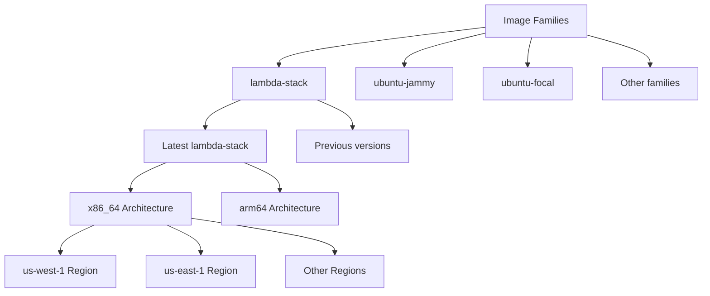

# Machine Images

This document details the operations available for working with machine images in Lambda Cloud through the Python client.

## Endpoint Overview

The Images module provides methods for retrieving information about available machine images:

- List all available machine images by region

## Image Concepts

Lambda Cloud images are used as the base operating system when launching instances. Each image belongs to a particular family and has a specific version. Images are available in different regions.

## Usage Examples

### Listing Available Images

```python
from lambda_cloud_python import LambdaCloudClient, Images

client = LambdaCloudClient(api_key="your-api-key")
images = Images(client)

# Get all available images
available_images = images.list()

# Display image details
for img in available_images:
    print(f"Image: {img['name']} (ID: {img['id']})")
    print(f"  Description: {img['description']}")
    print(f"  Family: {img['family']}")
    print(f"  Version: {img['version']}")
    print(f"  Architecture: {img['architecture']}")
    print(f"  Region: {img['region']['name']} ({img['region']['description']})")
    print(f"  Created: {img['created_time']}")
    print(f"  Updated: {img['updated_time']}")
    print("")
```

### Finding Images by Family

```python
from lambda_cloud_python import LambdaCloudClient, Images
from collections import defaultdict

client = LambdaCloudClient(api_key="your-api-key")
images = Images(client)

# Get all available images
available_images = images.list()

# Group images by family
families = defaultdict(list)
for img in available_images:
    families[img["family"]].append(img)

# Display available families and images
print("Available Image Families:")
for family, images in families.items():
    print(f"\nFamily: {family}")

    # Group by region
    by_region = defaultdict(list)
    for img in images:
        region = img["region"]["name"]
        by_region[region].append(img)

    # Display by region
    for region, region_images in by_region.items():
        print(f"  Region: {region}")
        for img in region_images:
            print(f"    - {img['name']} (v{img['version']}, {img['architecture']})")
```

### Using Images when Launching Instances

```python
from lambda_cloud_python import LambdaCloudClient, Images, Instances

client = LambdaCloudClient(api_key="your-api-key")
images = Images(client)
instances = Instances(client)

# First, list available images to find one we want
available_images = images.list()

# Find a specific image by family and region
target_family = "lambda-stack"
target_region = "us-west-1"
target_arch = "x86_64"

# Find matching images
matching_images = [
    img
    for img in available_images
    if img["family"] == target_family and img["region"]["name"] == target_region and img["architecture"] == target_arch
]

if matching_images:
    # Sort by creation time to get the latest
    latest_image = sorted(matching_images, key=lambda x: x["created_time"], reverse=True)[0]

    print(f"Found image: {latest_image['name']} (ID: {latest_image['id']})")

    # Launch an instance with this image
    result = instances.launch(
        region_name=target_region,
        instance_type_name="gpu_1x_a10",
        ssh_key_names=["my-ssh-key"],
        name="Instance with Custom Image",
        # Specify image by ID
        image={"id": latest_image["id"]}
        # Alternative: specify by family
        # image={"family": target_family}
    )

    print(f"Launched instance with ID: {result['instance_ids'][0]}")
else:
    print(f"No matching images found for family '{target_family}' in region '{target_region}'")
```

## Image Types and Relationships


