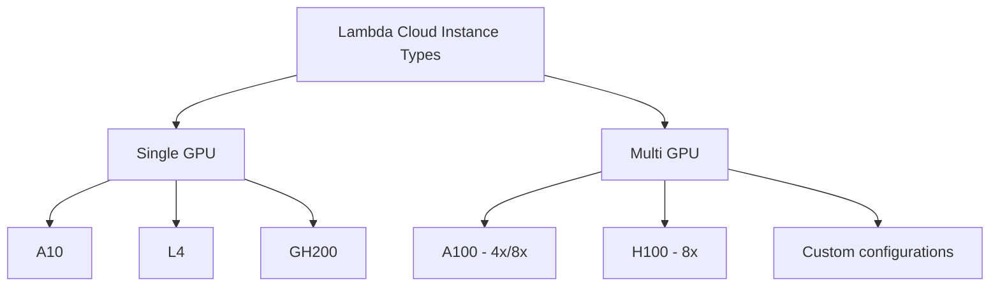

# Instance Types

This document details the operations available for working with Lambda Cloud instance types through the Python client.

## Endpoint Overview

The InstanceTypes module provides methods for retrieving information about available instance types in Lambda Cloud:

- List available instance types with specifications and availability

## Available Instance Types

The specific types available in Lambda Cloud vary over time as new hardware is added. The client will always provide the most up-to-date information about available types. Common GPU types include:

- H100
- A10
- A100
- GH200
- L4
- L40

## Usage Examples

### Listing Instance Types

```python
from lambda_cloud import LambdaCloudClient, InstanceTypes

client = LambdaCloudClient(api_key="your-api-key")
instance_types = InstanceTypes(client)

# Get all available instance types
available_types = instance_types.list()

# Process and display the instance types
for type_name, details in available_types.items():
    # Get the specifications
    specs = details["instance_type"]["specs"]
    price_per_hour = details["instance_type"]["price_cents_per_hour"] / 100

    # Display the information
    print(f"Instance Type: {type_name}")
    print(f"  Description: {details['instance_type']['description']}")
    print(f"  GPU: {details['instance_type']['gpu_description']}")
    print(f"  Price: ${price_per_hour}/hour")
    print(f"  Specs:")
    print(f"    CPUs: {specs['vcpus']}")
    print(f"    Memory: {specs['memory_gib']} GiB")
    print(f"    Storage: {specs['storage_gib']} GiB")
    print(f"    GPUs: {specs['gpus']}")

    # Show availability by region
    print("  Available in regions:")
    for region in details["regions_with_capacity_available"]:
        print(f"    - {region['name']} ({region['description']})")
    print("")
```

### Checking Availability in a Specific Region

```python
from lambda_cloud import LambdaCloudClient, InstanceTypes

client = LambdaCloudClient(api_key="your-api-key")
instance_types = InstanceTypes(client)

# Get all available instance types
available_types = instance_types.list()

# Check for the specific type and region you want
target_type = "gpu_8x_a100"
target_region = "us-west-1"

if target_type in available_types:
    regions_available = [r["name"] for r in available_types[target_type]["regions_with_capacity_available"]]

    if target_region in regions_available:
        print(f"{target_type} is available in {target_region}!")
        price = available_types[target_type]["instance_type"]["price_cents_per_hour"] / 100
        print(f"Price: ${price}/hour")
    else:
        print(f"{target_type} is not available in {target_region}")
        print(f"It is available in: {regions_available}")
else:
    print(f"{target_type} is not an available instance type")
```

## Instance Type Categories


