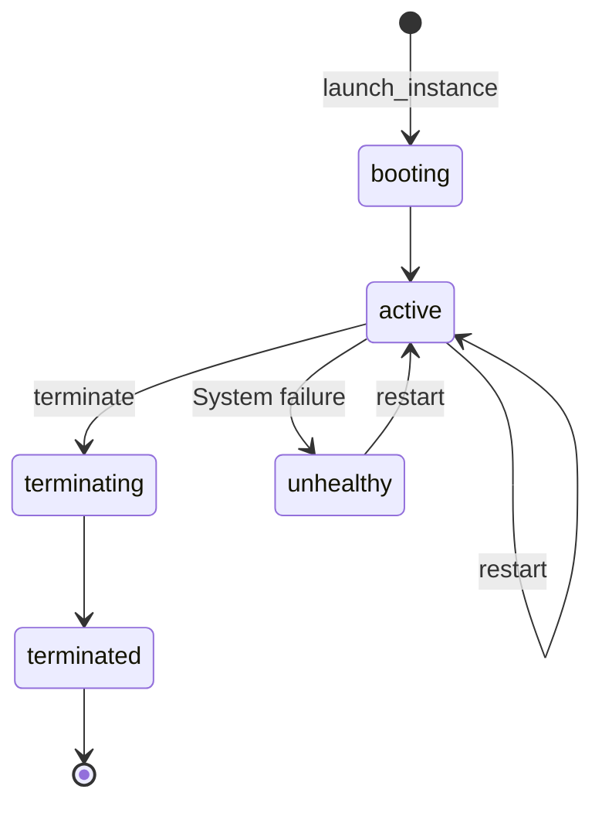

# Instance Operations

Instances are virtual machines that run on Lambda Cloud's infrastructure. The `Instance` provides methods to create, manage, and terminate instances.

## Instance Lifecycle



## Available Operations

### Listing Instances

Retrieve all running instances associated with your account:

```python
from lambda_cloud import LambdaCloudClient, Instance

client = LambdaCloudClient(api_key="your_api_key")
instance_api = Instance(client)

instances = instance_api.list_instances()
for instance in instances:
    print(f"Instance: {instance.name} ({instance.id})")
    print(f"  Status: {instance.status}")
    print(f"  Region: {instance.region.name}")
    print(f"  Type: {instance.instance_type.name}")
    print(f"  IP: {instance.ip}")
```

### Getting Instance Details

Retrieve detailed information about a specific instance:

```python
instance = instance_api.get_instance("INSTANCE_ID_STRING")
```

### Launching Instances

Create new instances with your desired configuration:

```python
from lambda_cloud.models.instance import InstanceLaunchRequest
from lambda_cloud.models.common import PublicRegionCode

# Configure the instance
launch_request = InstanceLaunchRequest(
    region_name=PublicRegionCode.US_WEST_1,
    instance_type_name="gpu_1x_a10",
    ssh_key_names=["my-ssh-key"],
    file_system_names=[],  # Optional
    name="ML Training Instance",  # Optional
)

# Launch the instance
response = instance_api.launch_instance(launch_request)
instance_ids = response.instance_ids
```

### Restarting Instances

Restart one or more running instances:

```python
from lambda_cloud.models.instance import InstanceRestartRequest

restart_request = InstanceRestartRequest(instance_ids=["INSTANCE_ID_STRING"])
response = instance_api.restart_instances(restart_request)
```

### Terminating Instances

Terminate instances when they're no longer needed:

```python
from lambda_cloud.models.instance import InstanceTerminateRequest

terminate_request = InstanceTerminateRequest(instance_ids=["INSTANCE_ID_STRING"])
response = instance_api.terminate_instances(terminate_request)
```

### Updating Instance Details

Update properties of an existing instance:

```python
from lambda_cloud.models.instance import InstanceModificationRequest

update_request = InstanceModificationRequest(name="New Instance Name")
updated_instance = instance_api.update_instance("INSTANCE_ID_STRING", update_request)
```

### Listing Available Instance Types

Get information about available instance types and their regional availability:

```python
instance_types = instance_api.list_instance_types()

for type_name, type_info in instance_types.__root__.items():
    instance_type = type_info.instance_type
    print(f"{type_name}: {instance_type.description}")
    print(f"  GPU: {instance_type.gpu_description}")
    print(f"  Price: ${instance_type.price_cents_per_hour / 100:.2f}/hour")
    print(
        f"  Specs: {instance_type.specs.gpus}x GPUs, {instance_type.specs.vcpus} vCPUs, {instance_type.specs.memory_gib} GiB RAM"
    )
    print(f"  Available regions:")
    for region in type_info.regions_with_capacity_available:
        print(f"    - {region.name} ({region.description})")
```

## Best Practices

1. **Check availability before launching**: Use `list_instance_types()` to check for available capacity in your preferred region.
2. **Use meaningful names**: Assign descriptive names to instances to make them easier to identify.
3. **Clean up resources**: Terminate instances when they're no longer needed to avoid unnecessary charges.
4. **Handle errors gracefully**: Implement proper error handling to manage cases like insufficient capacity.
