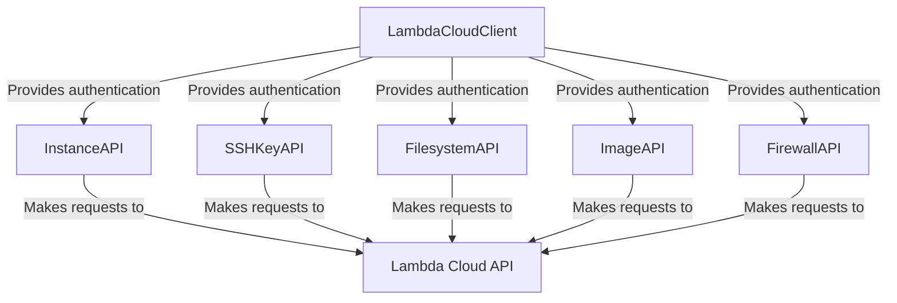

# Lambda Cloud API Client

This Python client provides a programmatic interface to the Lambda Cloud API, enabling you to manage computing resources like instances, SSH keys, filesystems, and more.

## Authentication

The Lambda Cloud API uses API keys to authenticate requests. You'll need to generate an API key from the [Lambda Cloud dashboard](https://cloud.lambdalabs.com/api-keys).

```python
from lambda_cloud import LambdaCloudClient

# Initialize the client with your API key
client = LambdaCloudClient(api_key="your_api_key_here")
```

## Available APIs

The client is divided into several API interfaces, each focusing on a specific resource type:

- **InstanceAPI**: Manage instances (list, launch, terminate, etc.)
- **SSHKeyAPI**: Manage SSH keys for instance access
- **FilesystemAPI**: Manage persistent storage
- **ImageAPI**: List available machine images
- **FirewallAPI**: Configure inbound network rules

## Architecture



## Error Handling

The client raises `httpx.HTTPStatusError` when API requests fail. You can catch these exceptions to handle errors gracefully:

```python
import httpx
from lambda_cloud import LambdaCloudClient, InstanceAPI

client = LambdaCloudClient(api_key="your_api_key_here")
instance_api = InstanceAPI(client)

try:
    instances = instance_api.list_instances()
except httpx.HTTPStatusError as e:
    if e.response.status_code == 401:
        print("Authentication failed. Check your API key.")
    elif e.response.status_code == 403:
        print("Account inactive or insufficient permissions.")
    else:
        print(f"API request failed: {e}")
```

## Resource Management

For optimal resource management, use the client as a context manager:

```python
with LambdaCloudClient(api_key="your_api_key_here") as client:
    instance_api = InstanceAPI(client)
    instances = instance_api.list_instances()
    # The client will be automatically closed when exiting the context
```
