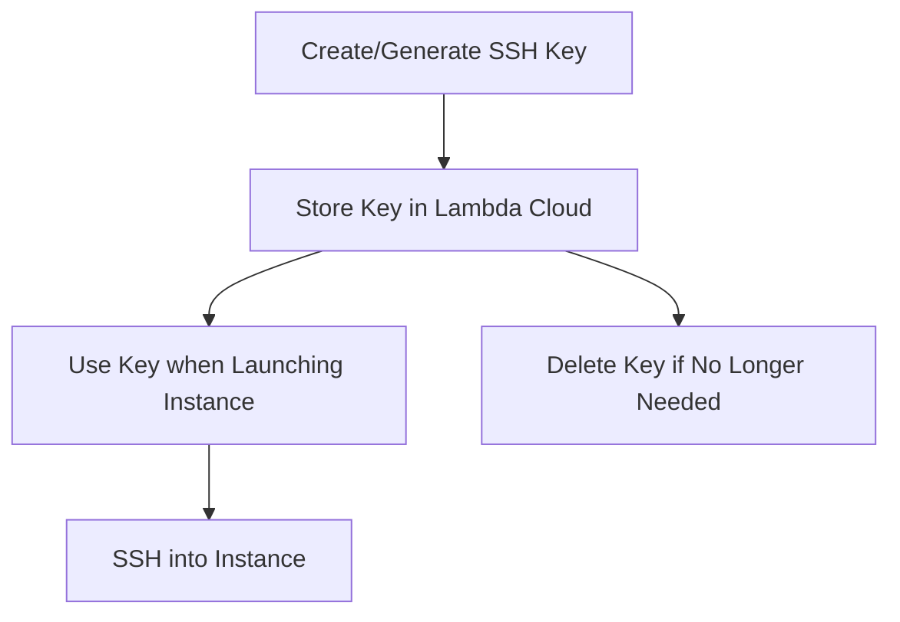

# SSH Keys

This document details the operations available for managing SSH keys in Lambda Cloud through the Python client.

## Endpoint Overview

The SSHKeys module provides methods for managing SSH authentication keys:

- List SSH keys in your account
- Add a new SSH key (either upload existing or generate new)
- Delete an SSH key

## SSH Key Workflow



## Usage Examples

### Listing SSH Keys

```python
from lambda_cloud import LambdaCloudClient, SSHKeys

client = LambdaCloudClient(api_key="your-api-key")
ssh_keys = SSHKeys(client)

# Get all SSH keys
keys = ssh_keys.list()

# Display key details
for key in keys:
    print(f"Key: {key['name']} (ID: {key['id']})")
    print(f"  Public Key: {key['public_key'][:30]}...")
```

### Adding an Existing SSH Key

```python
from lambda_cloud import LambdaCloudClient, SSHKeys

client = LambdaCloudClient(api_key="your-api-key")
ssh_keys = SSHKeys(client)

# Read an existing public key file
with open("~/.ssh/id_ed25519.pub", "r") as f:
    public_key_content = f.read().strip()

# Add the key to Lambda Cloud
key = ssh_keys.add("my-laptop-key", public_key=public_key_content)

print(f"Added key: {key['name']} (ID: {key['id']})")
```

### Generating a New SSH Key

```python
from lambda_cloud import LambdaCloudClient, SSHKeys

client = LambdaCloudClient(api_key="your-api-key")
ssh_keys = SSHKeys(client)

# Generate a new key
key = ssh_keys.add("new-generated-key")

print(f"Generated key: {key['name']} (ID: {key['id']})")

# Save the private key locally - IMPORTANT!
# Lambda does not store the private key after generation
with open("new_key.pem", "w") as f:
    f.write(key["private_key"])

print("Private key saved to new_key.pem")

# Set appropriate permissions on the key file
import os

os.chmod("new_key.pem", 0o400)  # Read-only by owner
```

### Deleting an SSH Key

```python
from lambda_cloud import LambdaCloudClient, SSHKeys

client = LambdaCloudClient(api_key="your-api-key")
ssh_keys = SSHKeys(client)

# Delete a key by ID
key_id = "ddf9a910ceb744a0bb95242cbba6cb50"
ssh_keys.delete(key_id)

print(f"SSH key {key_id} deleted successfully")
```

### Workflow: Generate Key and Launch Instance

```python
from lambda_cloud import LambdaCloudClient, SSHKeys, Instances
import os

client = LambdaCloudClient(api_key="your-api-key")
ssh_keys = SSHKeys(client)
instances = Instances(client)

# Step 1: Generate a new key
key_name = "instance-access-key"
key = ssh_keys.add(key_name)

# Step 2: Save the private key
key_file = "instance_key.pem"
with open(key_file, "w") as f:
    f.write(key["private_key"])

# Set proper permissions
os.chmod(key_file, 0o400)
print(f"Private key saved to {key_file}")

# Step 3: Launch an instance with the new key
result = instances.launch(
    region_name="us-west-1", instance_type_name="gpu_1x_a10", ssh_key_names=[key_name], name="My New Instance"
)

instance_id = result["instance_ids"][0]
print(f"Launched instance: {instance_id}")

# Step 4: Get instance details for SSH access
instance = instances.get(instance_id)
ip_address = instance["ip"]

print(f"You can connect to your instance using:")
print(f"ssh -i {key_file} ubuntu@{ip_address}")
```
